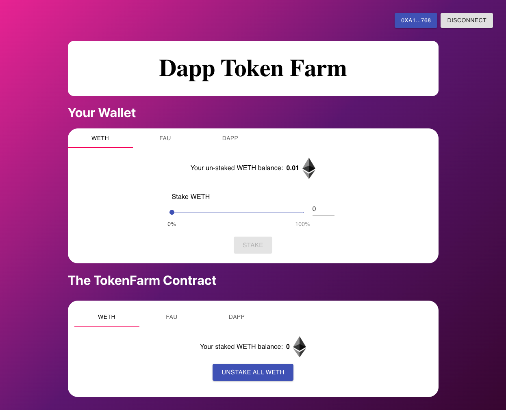

# TAave

<br/>
<p align="center">

</a>
</p>
<br/>

## Summary

This project is a Defi app for yield farming, borrowing, and lending crypto assets. It is strongly inspired by the Aave protocol. It specifically allows you to:

- `stakeTokens`: Add any approved token to the farming contract for yeild farming, collateral, or whatever you want to do.
- `unStakeTokens`: Remove your tokens from the contract.
- `getUserTotalValue`: Get the total value that users have supplied based on calculations from the Chainlink Price Feeds.
- `issueTokens`: Issue a reward to the users staking on your platform!

And more!

- [TAave](#TAave)
  - [Summary](#summary)
  - [Prerequisites](#prerequisites)
- [Useage](#useage)
  - [Scripts](#scripts)
  - [Front end](#front-end)
  - [Testing](#testing)
- [License](#license)

## Prerequisites

Please install or have installed the following:

- [nodejs and npm](https://nodejs.org/en/download/)
- [python](https://www.python.org/downloads/)
- [brownie](https://eth-brownie.readthedocs.io/en/stable/install.html)
- [ganache-cli](https://www.npmjs.com/package/ganache-cli)

# Useage

## Scripts

```bash
brownie run scripts/deploy.py
```

This will deploy the contracts, depoly some mock Chainlink contracts for you to interact with.

```bash
brownie run scripts/deploy.py --network kovan
```

This will do the same thing... but on Kovan.

## Front end

```bash
cd front_end
yarn
yarn start
```

and you'll be able to interact with the UI

## Testing

```
brownie test
```

# License

This project is licensed under the [MIT license](LICENSE).
